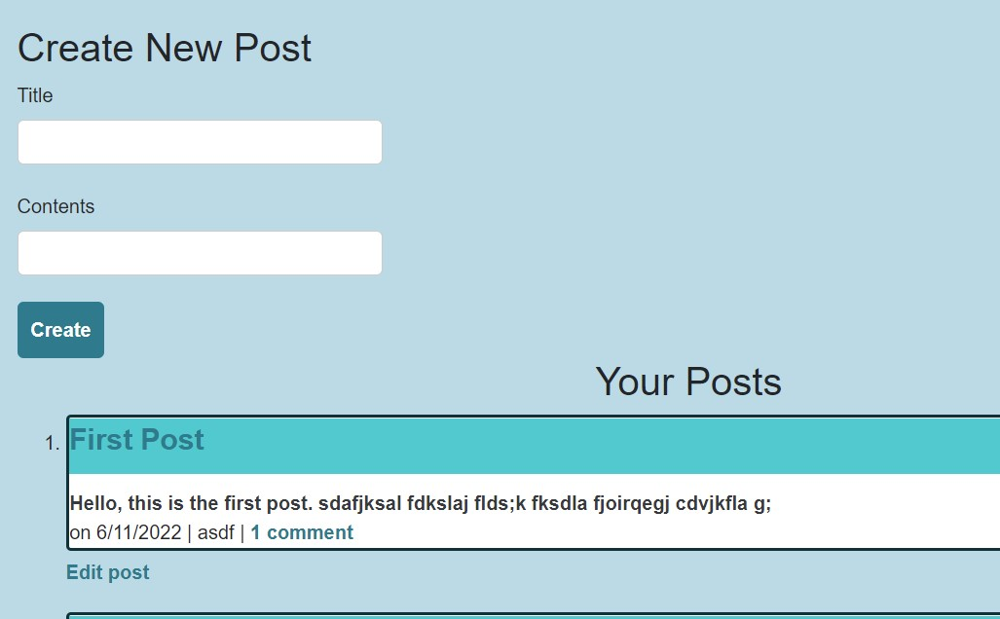

# Blog

# User Story
AS A developer who writes about tech
I WANT a CMS-style blog site
SO THAT I can publish articles, blog posts, and my thoughts and opinions

## Description
This is a website that is used as a blog for developers to write posts about tech and comment on each other's posts.

## Homepage
The homepage of this application displays all of the blog posts and when they were created:

From the homepage a user can also click on an individual blog post and be brought to a page where they can view the entire post details and comments. If the user is logged in, they can also leave a comment.

## Dashboard
In order to access the Dashboard, a User must create an account and sign-in. 

Once signed in, the user can create new posts, or either edit or delete existing posts. 

## Built With
This program uses the following:
* Javascript (including sequelize, handlebars and more)
